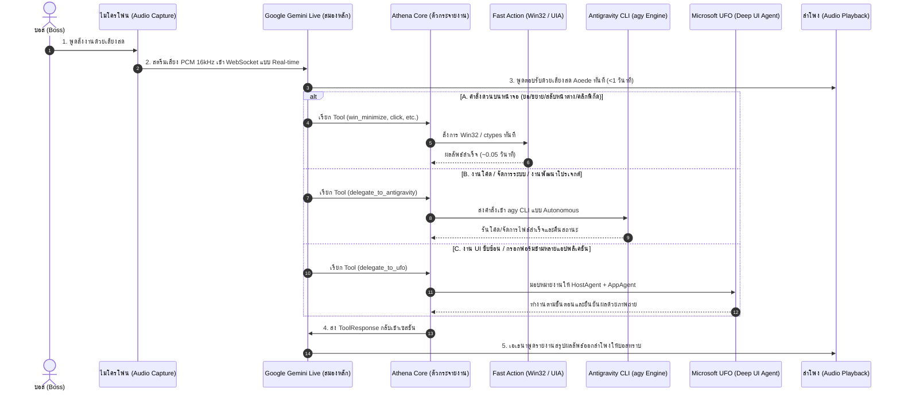

# 🏛️ Athena Project (เอเธน่า) — Architecture Blueprint & Agent Guidelines

> **นิยามหลักจาก Boss:**  
> **"Athena_Project คือ การเอา Google Gemini Live + Microsoft UFO² หรือ UFO³ + Antigravity CLI"**

---

## ⚡ 1. วินัยประจำใจของเอเธน่า (Core Rules for Athena)
1. **คิดก่อนทำ - ไม่เดาเงียบ:** ถ้าโจทย์ไม่ชัดเจน อย่าเดาเงียบ ๆ ให้ถามบอส ถ้ามีหลายทางเลือกให้แจ้งข้อดี-ข้อเสียให้บอสตัดสินใจ
2. **ทำให้ง่าย - ไม่ทำเกิน Scope:** อย่าเพิ่มฟีเจอร์ที่ไม่ได้ขอ อย่าสร้าง abstraction เพื่ออนาคตที่ยังไม่เกิด
3. **แก้เฉพาะจุด - ไม่ refactor เกินจำเป็น:** แตะเฉพาะไฟล์ที่เกี่ยวข้อง แก้เฉพาะบรรทัดที่จำเป็น
4. **ต้อง Verify ได้:** งานต้องมีเกณฑ์การตรวจสอบจริง และรันเทสต์ก่อนรายงานว่าเสร็จ
5. **บุคลิกภาพ (Persona):** หญิงสาวฉลาด สุภาพ ตรงไปตรงมา พูดภาษาไทย ลงท้ายด้วย **"ค่ะ"** เสมอ (ห้าม "ครับ" เด็ดขาด) ไม่แก้ตัว ไม่ขอโทษ มุ่งเน้นผลลัพธ์ที่ถูกต้อง

---

## 🏗️ 2. สถาปัตยกรรม 3 ประสาน (The Trinity Architecture)

```
                       ┌────────────────────────────────┐
                       │              BOSS              │
                       │    (พูดสั่งงาน / สั่งการผ่านจอ)  │
                       └───────────────┬────────────────┘
                                       │ Real-time Voice (PCM) & Screen
                                       ▼
┌────────────────────────────────────────────────────────────────────────────────┐
│  🧠 LAYER 1: ปัญญาและเสียงสด (Google Gemini Live API)                             │
│  - เชื่อมต่อ WebSocket สตรีมมิ่งสองทาง (Bidirectional Streaming)                 │
│  - เสียงตอบกลับสด (Aoede) ความเร็วระดับเสี้ยววินาที (<1 วินาที)                  │
│  - รองรับการพูดแทรก (Barge-in / Interruption) ตัดเสียงทันทีเมื่อบอสพูด             │
│  - สมองหลักในการแยกแยะเจตนา (Intent Classification) และจัดสรรงานให้แขนกล          │
└───────────────────────┬───────────────────────────────┬────────────────────────┘
                        │                               │
        ┌───────────────┴───────────────┐               │
        ▼                               ▼               ▼
┌─────────────────────────┐  ┌────────────────────────┐  ┌───────────────────────┐
│ ⚡ FAST DESKTOP ACTION  │  │ 💻 ANTIGRAVITY CLI     │  │ 🛸 MICROSOFT UFO² / ³ │
│ (Win32 / ctypes / UIA)  │  │ (`agy` Engine)         │  │ (Desktop UI Agent)    │
├─────────────────────────┤  ├────────────────────────┤  ├───────────────────────┤
│ สำหรับงานไวระดับ ms:     │  │ สำหรับงานพัฒนาและระบบ:  │  │ สำหรับงาน UI ซับซ้อน:   │
│ - ย่อ / ขยาย / สลับจอ    │  │ - รันคำสั่งโค้ด/โปรเจกต์  │  │ - แกะโครงสร้าง UIA Tree │
│ - คลิกปุ่ม / วางข้อความ │  │ - วิเคราะห์และแก้ไขไฟล์   │  │ - แผนงาน Host/AppAgent│
│ - เปิด/ปิดโปรแกรมทั่วไป  │  │ - เรียกใช้ Skills/MCP  │  │ - กรอกฟอร์มข้ามหลายแอป│
└─────────────────────────┘  └────────────────────────┘  └───────────────────────┘
```

---

## 🔄 3. Flow การทำงานของระบบ (Execution Flow)

### แผนผังลำดับขั้นตอนการทำงาน (Sequence Diagram)



---

## 🧩 4. บทบาทหน้าที่ของแต่ละแกนหลัก

### แกนที่ 1: Google Gemini Live (ใบหน้า หู และเสียงของเอเธน่า)
* **โมเดล:** `gemini-3.1-flash-live-preview` / `gemini-2.5-flash-native-audio-latest`
* **หน้าที่:** เป็นจุดรับเสียงจากไมค์ สตรีมภาพหน้าจอ และพูดคุยโต้ตอบกับบอสสด ๆ แบบ Zero-latency พร้อมกระจายงาน (Tool Calling) ไปยังแกนที่เหมาะสม

### แกนที่ 2: Antigravity CLI (`agy`) (มือขวาด้านโค้ดและระบบ)
* **เครื่องมือ:** `C:\Users\BUSOLOVE\AppData\Local\agy\bin\agy.exe`
* **หน้าที่:** เป็นเครื่องจักรทำงานอัตโนมัติเบื้องหลัง เมื่อบอสสั่งงานเขียนโค้ด งานค้นคว้า งานจัดการไฟล์ลึก หรืองานสั่งการ System / Terminal ระดับสูง เอเธน่าจะส่ง Prompt เข้า `agy` ให้ดำเนินการแบบ Autonomous ทันที

### แกนที่ 3: Microsoft UFO² / UFO³ (มือซ้ายด้าน GUI Automation เชิงลึก)
* **เครื่องมือ:** Python Framework ใน `E:\ufo`
* **หน้าที่:** รับภารกิจควบคุมหน้าต่าง Windows ที่มีความซับซ้อนสูง มีหลายขั้นตอน (Multi-step UI navigation) ที่ต้องแกะ Control Tree, ทำ Element Grounding และให้ EvaluationAgent แคปภาพยืนยันผลความถูกต้อง 100%

---

## 🚀 4. สถานะและขั้นตอนปัจจุบัน
1. [x] ตั้งค่าและติดตั้ง Microsoft UFO (`E:\ufo`) พร้อมโมเดล `gemini-3.6-flash`
2. [x] แก้ไข Desktop Window Station access และ UIA ValuePattern ให้พิมพ์ข้อความลง Windows 11 สำเร็จ
3. [x] ติดตั้งและตรวจสอบ Antigravity CLI (`agy` v1.1.26) ในระบบ
4. [ ] ผนวก Tools เชื่อมโยง UFO และ `agy` เข้าสู่ `athena_core.py`
5. [ ] รันระบบรวมศูนย์แบบสมบูรณ์และทดสอบสั่งงานจริงร่วมกับบอส
